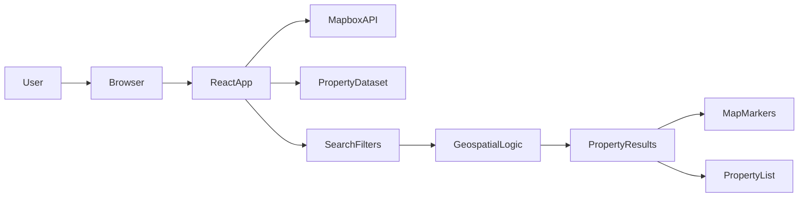
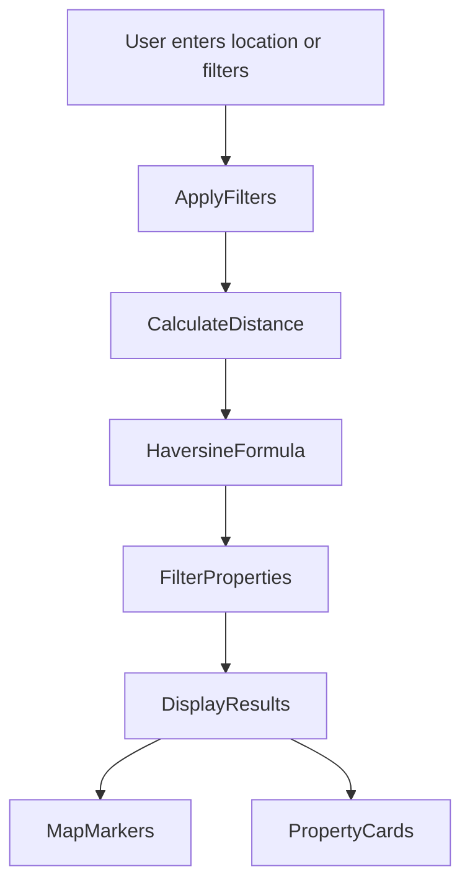
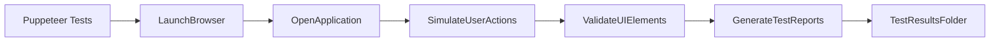

# 🏡 Real Estate Geospatial Search Platform

A modern **real estate web application** that allows users to explore property listings using an **interactive map**, advanced geospatial filtering, and automated browser testing.

This project demonstrates how to build **location-aware web applications** and how to test complex user interactions using **Puppeteer integration testing**.

---

# 🚀 Project Overview

This platform provides a **map-based property search experience** where users can:

- View property listings on an interactive map
- Search properties by location
- Filter properties using radius, price, and bedrooms
- Draw custom search boundaries on the map
- View detailed property information
- Save and reload search filters
- Run automated integration tests

The entire project is **fully containerized using Docker**, enabling easy setup and consistent environments.

---

# ✨ Key Features

## 🗺 Interactive Map
- Map integration using **Mapbox GL JS**
- Displays markers for property locations
- Supports zooming and panning
- Marker interaction highlights property cards

## 🔍 Advanced Property Search
Users can filter properties using:

- Location autocomplete
- Radius-based geospatial search
- Price range filters
- Bedroom selection
- Polygon boundary drawing on the map

## 🏠 Property Listings
- Property cards with title, price, and address
- List view synchronized with map markers
- Quick navigation to property detail pages

## 📄 Property Detail Page
Displays complete information about a property including:

- Property title and price
- Full address
- Map showing property location
- Coordinates
- Nearby amenities with distance calculations

## 💾 Saved Searches
Users can:

- Save search filters
- View saved searches
- Load previous search criteria
- Delete saved searches

## 🧪 Automated Integration Testing
Integration tests simulate real user interactions to verify application functionality.

Tests validate:

- Map initialization
- Location autocomplete
- Radius-based filtering
- Boundary-based filtering
- Marker interactions
- Property filtering
- Saved search functionality

---

# 🧰 Technology Stack

Frontend:
- React
- Mapbox GL JS
- JavaScript
- CSS / UI framework

Testing:
- Puppeteer

DevOps:
- Docker
- Docker Compose

---

# ⚙️ Environment Variables

Create a `.env` file based on `.env.example`.

Example:

```
MAPBOX_ACCESS_TOKEN=pk.test.mock-token-for-testing-purposes
MAPBOX_STYLE=mapbox://styles/mapbox/streets-v11
```

The mock token allows tests to run without requiring a real Mapbox API key.

---

# 🐳 Running the Project

Start the application using Docker:

```
docker-compose up
```

The application will run at:

```
http://localhost:3006
```

---

# 🧪 Running Integration Tests

Execute the Puppeteer integration tests:

```
docker-compose exec puppeteer-integration-tests npm run test:integration
```

Test results are generated inside:

```
/test-results
```

Generated files include:

- `integration-report.json`
- `geospatial-test-summary.json`
- `screenshots/`

---

# 📊 System Architecture



---

# 🔎 Geospatial Search Workflow



---

# 🧪 Integration Testing Workflow



---

# 📌 Geospatial Distance Calculation

The application calculates distances between coordinates using the **Haversine Formula**.  
This allows accurate radius-based property filtering based on geographic coordinates.

---

# 🎯 Learning Outcomes

This project demonstrates how to:

- Build interactive map-based web applications
- Implement geospatial filtering logic
- Integrate third-party APIs
- Test complex UI interactions with browser automation
- Handle asynchronous operations in frontend applications
- Containerize applications using Docker

---

# 👨‍💻 Author

Developed as part of a project focused on **geospatial web applications and automated testing workflows**.

---

# 📜 License

This project is intended for **educational and demonstration purposes**.
